# Lab7Web

|  | |
| ----------- | ----------- |
| <b> Nama     | Dini Ramadani       |
| <b> NIM     | 312310120       |
| <b> Kelas   | TI.23.C2        |
| <b> Matakuliah   | Pemrograman Web 2      |
|  | |

 # DAFTAR TUGAS PRAKTIKUM

<table border="2" cellpading="10">
  <tr>
    <td><b>Praktikum 1</b></td>
    <td> PHP Framework (Codeigniter)</td>
    <td><a href="https://github.com/diniramadani/Lab7Web/tree/main/Praktikum_1">Klik disini</td>
  </tr>
  <tr>
    <td><b>Praktikum 2</b></td>
    <td>Framework Lanjutan (CRUD)</td>
    <td><a href="https://github.com/diniramadani/Lab7Web/tree/main/Praktikum_2">Klik disini</td>
  </tr>
  <tr>
    <td><b>Praktikum 3</b></td>
    <td>View Layout dan View Cell</td>
    <td><a href="">Klik disini</td>
  </tr>
</table>_________________________________________________________________________________
_________________________________________________________________________________
<div id="p11">


# <spaan style="color: blue">Praktikum 1 | PHP Framework (Codeigniter)</span>

## Langkah langkah praktikum
## Persiapan
Sebelum memulai menggunakan Framework Codeigniter, perlu dilakukan konfigurasi
pada webserver. Beberapa ekstensi PHP perlu diaktifkan untuk kebutuhan
pengembangan Codeigniter 4.
Berikut beberapa ekstensi yang perlu diaktifkan:
- php-json ekstension untuk bekerja dengan JSON;
- php-mysqlnd native driver untuk MySQL;
- php-xml ekstension untuk bekerja dengan XML;
- php-intl ekstensi untuk membuat aplikasi multibahasa;
- libcurl (opsional), jika ingin pakai Curl.

Untuk mengaktifkan ekstentsi tersebut, melalu XAMPP Control Panel, pada bagian
Apache klik ``Config -> PHP.ini``

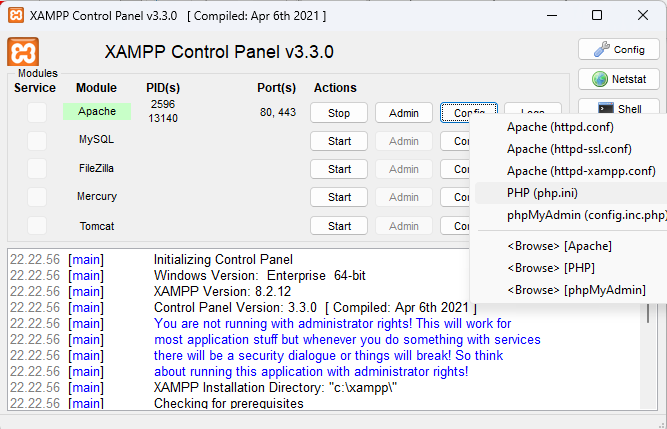

Pada bagian extention, hilangkan tanda ; (titik koma) pada ekstensi yang akan
diaktifkan. Kemudian simpan kembali filenya dan restart Apache web server.

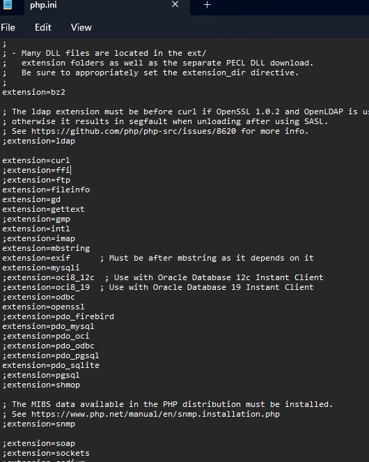

## Instalasi  Codeigniter 4
Untuk melakukan instalasi Codeigniter 4 dapat dilakukan dengan dua cara, yaitu cara manual dan menggunakan composer. Pada praktikum ini kita menggunakan cara
manual.
- Unduh Codeigniter dari website https://codeigniter.com/download
- Extrak file zip Codeigniter ke direktori htdocs/lab11_ci.
- Ubah nama direktory framework-4.x.xx menjadi ci4.
- Buka browser dengan alamat http://localhost/lab11_ci/ci4/public/

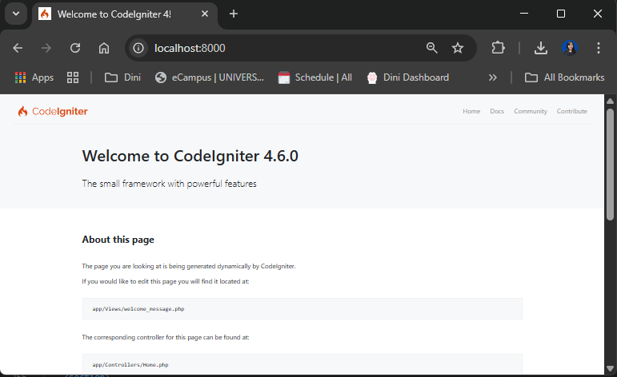

## Menjalankan CLI (Command Line Interface)
Codeigniter 4 menyediakan CLI untuk mempermudah proses development. Untuk
mengakses CLI buka terminal/command prompt.

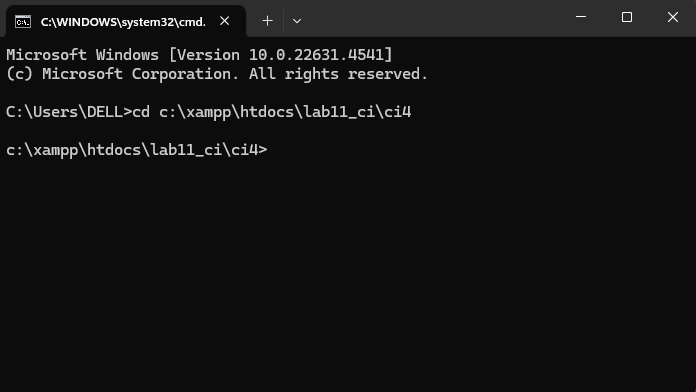

Arahkan lokasi direktori sesuai dengan direktori kerja project dibuat ``(xampp/htdocs/lab11_ci/ci4/)``.

Perintah yang dapat dijalankan untuk memanggil CLI Codeigniter adalah :
```
php spark
```

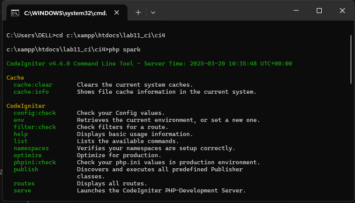

## Mengaktifkan Mode Debugging
- Ketik ``php spark serve`` pada CLI untuk menjalankan.

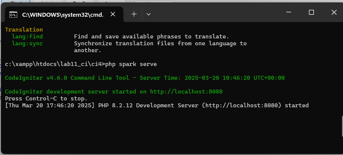

- Menampilkan pesan error, untuk mencobanya ubah kode file ``app/Controllers/home.php``, hapus ;nya.
  Ketik ``http://localhost:8080`` pada browser. Berikut tampilan error nya.

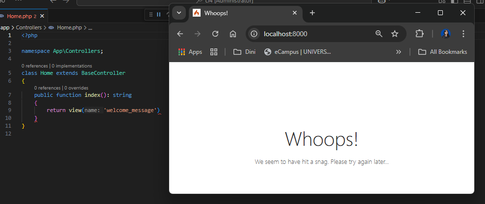

- Kemudian, ubah nama file ``env`` menjadi ``.env``. Masuk ke dalam filenya, hapus tanda ``#`` pada ``CI_ENVIRONMENT =``

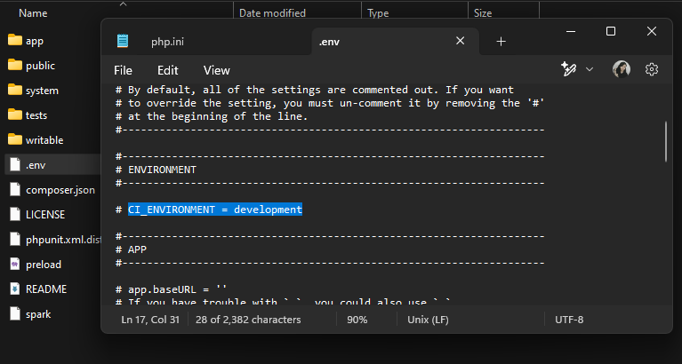


## Struktur Direktori

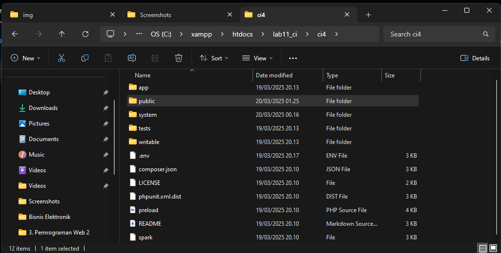

## Routing and Controller
Router terletak pada file ``app/config/Routes.php``

## Membuat Route Baru
Tambahkan kode berikut di dalam ``Routes.php``
```php
$routes->get('/about', 'Page::about');
$routes->get('/contact', 'Page::contact');
$routes->get('/faqs', 'Page::faqs');
```

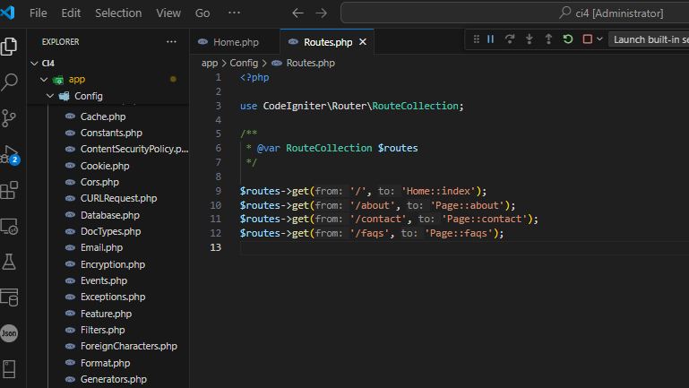

Untuk mengetahui route yang ditambahkan sudah benar, buka CLI dan jalankan
perintah berikut.
```
php spark routes
```
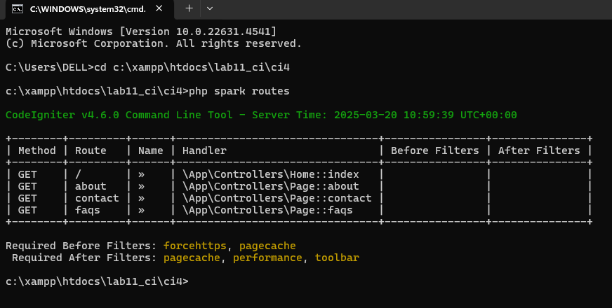

Selanjutnya coba akses route yang telah dibuat dengan mengakses alamat url http://localhost:8080/about

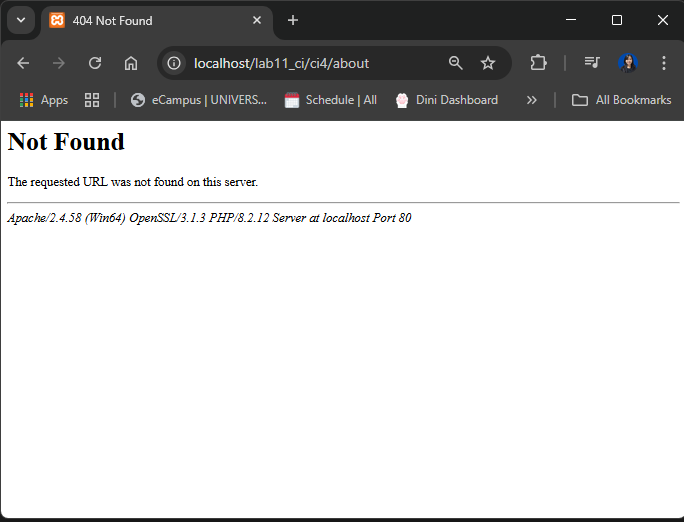

## Membuat Controller
Selanjutnya adalah membuat Controller Page. Buat file baru dengan nama ``page.php`` pada direktori Controller kemudian isi kodenya seperti berikut.
```php
<?php
namespace App\Controllers;
class Page extends BaseController
{
    public function about()
    {
        echo "Ini halaman About";
    }

    public function contact()
    {
        echo "Ini halaman Contact";
    }

    public function faqs()
    {
        echo "Ini halaman FAQ";
    }
}
```

Selanjutnya refresh Kembali browser, maka akan ditampilkan hasilnya yaitu halaman sudah dapat diakses.

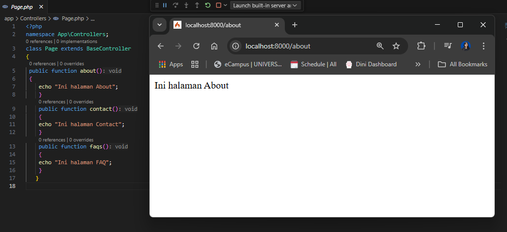

- Auto Routing
Secara default fitur autoroute pada Codeiginiter sudah aktif. Untuk mengubah status autoroute dapat mengubah nilai variabelnya. Untuk menonaktifkan ubah nilai ``true`` menjadi ``false``.
```php
$routes->setAutoRoute(true);
```
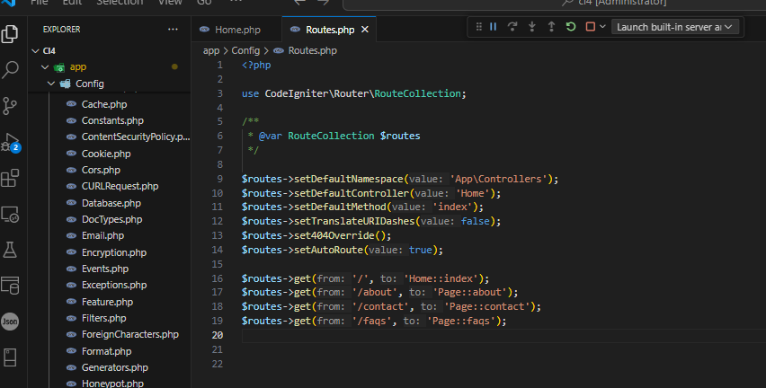

Tambahkan method baru pada Controller Page seperti berikut.
```php
public function tos()
{
    echo "ini halaman Term of Services";
}
```
Method ini belum ada pada routing, sehingga cara mengaksesnya dengan menggunakan alamat: http://localhost:8080/page/tos

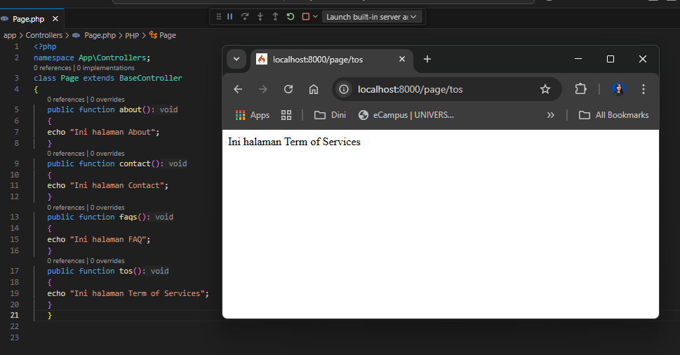

## Membuat View
Selanjutnya adalam membuat view untuk tampilan web agar lebih menarik. Buat file baru dengan nama ``about.php`` pada direktori view ``(app/view/about.php)`` kemudian isi kodenya seperti berikut.
```php
<!DOCTYPE html>
<html lang="en">
    <head>
        <meta charset="UTF-8">
        <title><?= $title; ?></title>
    </head>
    <body>
        <h1><?= $title; ?></h1>
        <hr>
        <p><?= $content; ?></p>
    </body>
</html>
```


Ubah ``method about`` pada class ``Controller Page`` menjadi seperti berikut:
```php
public function about()
{
    return view('about', [
        'title' => 'Halaman About',
        'content' => 'Ini adalah halaman abaut yang menjelaskan tentang isi halaman ini.'
        ]);
}
```
Kemudian lakukan refresh pada halaman tersebut.
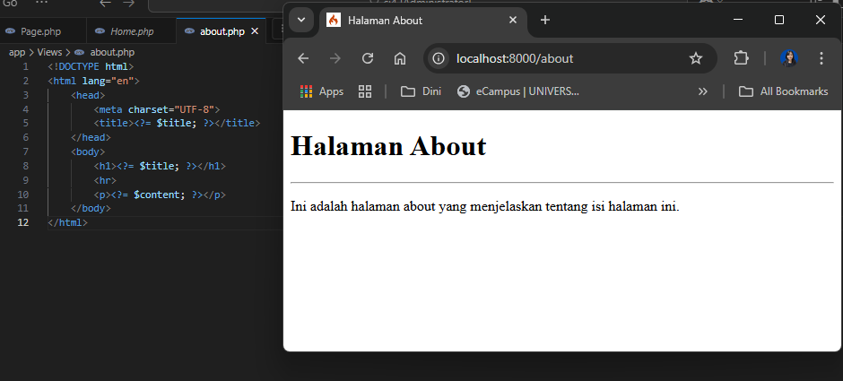

## Membuat Layout Web dengan CSS
Buat file css pada direktori ``public`` dengan nama ``style.css`` (copy file dari praktikum ``lab4_layout``. Kita akan gunakan layout yang pernah dibuat pada praktikum 4.

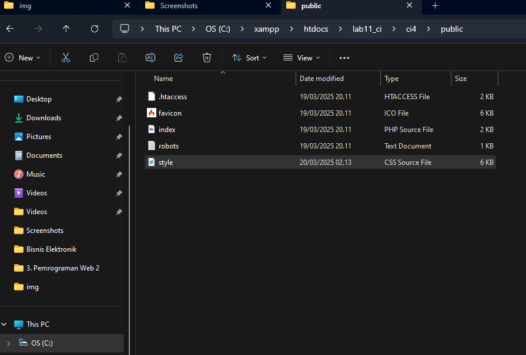

Kemudian buat folder template pada direktori view kemudian buat file ``header.php`` dan ``footer.php``
```php
<!DOCTYPE html>
<html lang="en">
<head>
    <meta charset="UTF-8">
    <title><?= $title; ?></title>
    <link rel="stylesheet" href="<?= base_url('/style.css');?>">
</head>
<body>
    <div id="container">
        <header>
            <h1>Layout Sederhana</h1>
        </header>
        <nav>
            <a href="<?= base_url('/');?>" class="active">Home</a>
            <a href="<?= base_url('/artikel');?>">Artikel</a>
            <a href="<?= base_url('/about');?>">About</a>
            <a href="<?= base_url('/contact');?>">Kontak</a>
        </nav>
        <section id="wrapper">
            <section id="main">
```
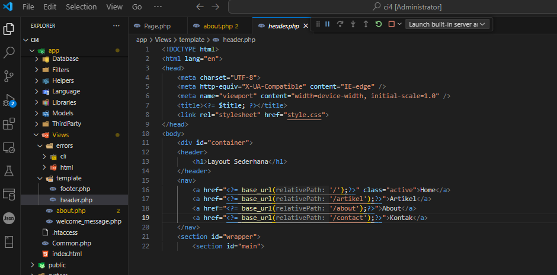

File ``app/view/template/footer.php``
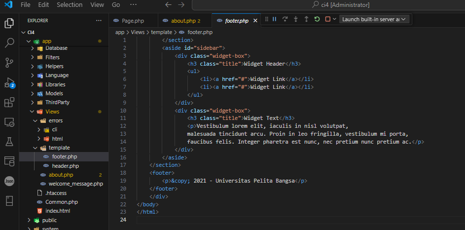

Kemudian ubah file ``app/view/about.php`` seperti berikut.
```php
<?= $this->include('template/header'); ?>
<h1><?= $title; ?></h1>
<hr>
<p><?= $content; ?></p>
<?= $this->include('template/footer'); ?>
```


Selanjutnya refresh tampilan pada alamat http://localhost:8080/about

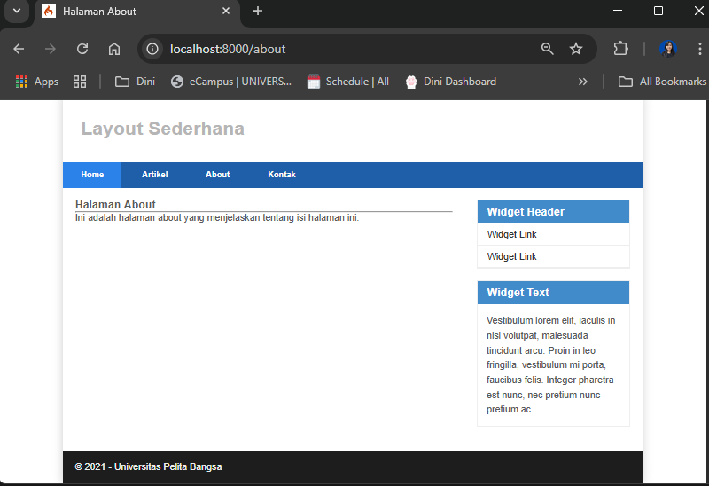

